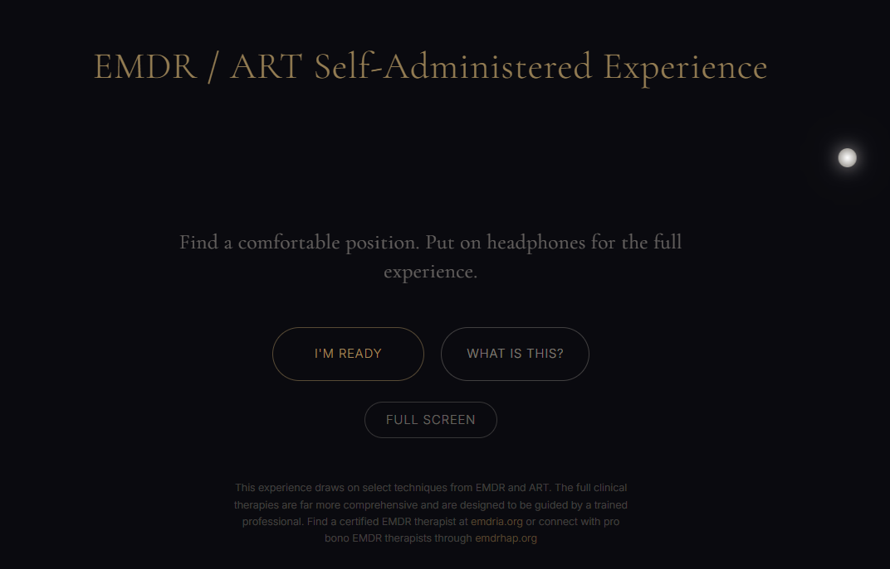
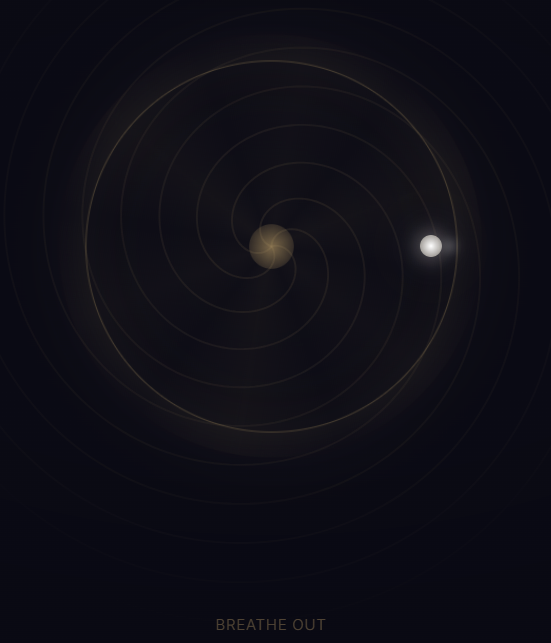
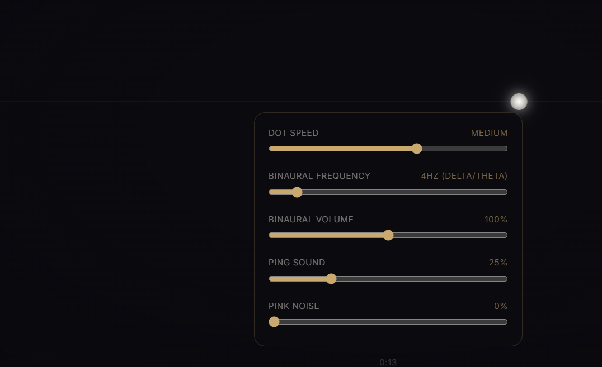
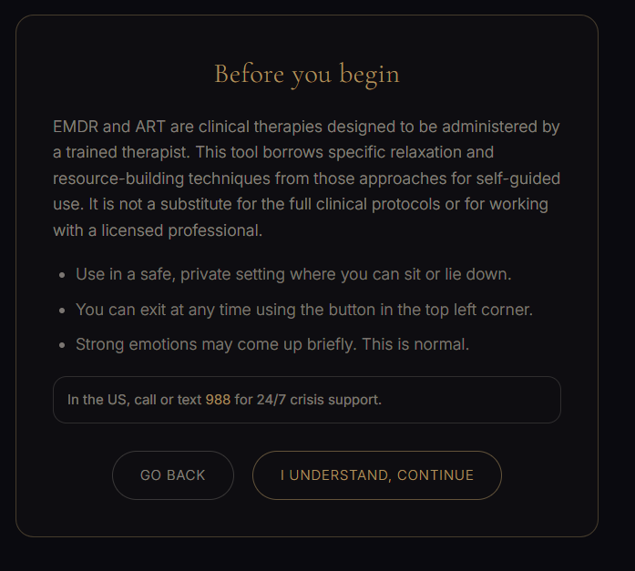
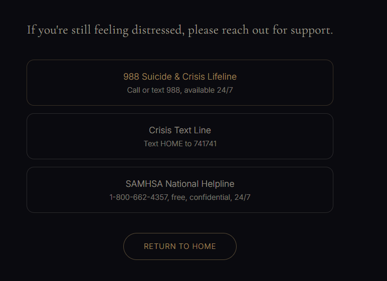

# EMDR / ART Self-Administered Experience

A free, browser-based guided self-regulation tool. Four modes (EMDR resource-building, ART memory rescripting, guided hypnotic meditation, and a customizable bilateral stimulation tool), all running entirely in the browser with no backend, no accounts, and no data collection.

> **This is a wellness and educational tool, not a substitute for professional therapy.**
> Find a certified EMDR therapist at [emdria.org](https://www.emdria.org/find-an-emdr-therapist/) or connect with pro bono therapists through [emdrhap.org](https://www.emdrhap.org/).

## Live demo

**[hypno1-amber.vercel.app](https://hypno1-amber.vercel.app/)** (headphones recommended)


*The landing page. A slow-moving bilateral dot tracks across the screen while the user decides between four modes. Everything runs in the browser with no backend.*

<p align="center">


</p>

<p align="center">
<em>Left: Guided meditation. A 5-arm logarithmic spiral rotates while the breathing guide expands and contracts on a 4-4-6 cycle. Binaural tones deepen from theta toward delta over 30 minutes. Right: The lateral eye movement tool. Five sliders let the user tune dot speed, binaural frequency (0-40 Hz), volume, ping sound, and pink noise in real time.</em>
</p>

<p align="center">


</p>

<p align="center">
<em>Left: Every session starts with a safety gate explaining what this tool is and isn't. Right: If distress hits 10/10, the app exits the session immediately, runs a grounding exercise, and lands here with crisis resources. There is no button to navigate away. The user stays with these resources as long as they need.</em>
</p>

## Why this exists

EMDR and ART are evidence-based therapies with strong clinical outcomes, but access is limited by cost, availability, and waitlists. This project asks: what if the core bilateral stimulation techniques were available to anyone with a browser and headphones?

It is not a replacement for working with a therapist. It implements a simplified subset of these therapies: resource-building from EMDR, image rescripting from ART, and a hypnotic meditation that layers binaural tones, breathing guidance, and progressive relaxation. The goal is to give people a structured, consent-forward tool they can use on their own terms.

## What it does

### Four modes

| Mode | Duration | What happens |
|------|----------|-------------|
| **EMDR** | 10-15 min | Safe place visualization, butterfly hug, container exercise, resource installation, each paired with bilateral eye movements |
| **ART** | 10-20 min | Select a stressful scene, process it with fast bilateral eye movements, then rescript it into something better. Loops until distress drops |
| **Meditation** | Up to 30 min | Guided or silent. Hypnotic induction, breathing sync, binaural tones deepening from theta to delta, positive suggestion cues, anchoring. End whenever you're ready |
| **Lateral** | Open-ended | Adjustable bilateral dot with sliders for speed, binaural frequency (0-40 Hz), binaural volume, ping sound, and pink noise |

### Safety and consent

Every session begins with a safety gate explaining what the tool is and isn't. EMDR and ART sessions monitor distress throughout using the SUD (Subjective Units of Distress) scale:

- **Before starting:** If distress is above 5, the user is routed through a grounding exercise before proceeding
- **During ART:** Distress is rechecked after each processing round. The loop continues until it drops below 2
- **If distress hits 10:** An adverse event protocol exits the session immediately
- **After every session:** Crisis resources are shown (988 Suicide & Crisis Lifeline, Crisis Text Line)
- **At any point:** The exit button is always visible in the top-left corner

### Session tracking

Completed EMDR and ART sessions are stored locally with before/after distress scores. The end summary shows improvement and session history so users can see patterns over time. All data stays in the browser. Nothing leaves the device.

## How it works

The app layers 40 techniques across audio, visual, language, breathing, bilateral stimulation, and body-based categories. All audio is synthesized in real-time with the Web Audio API, with no pre-recorded sound files for the sound engine. Voice narration uses pre-generated ElevenLabs MP3s with Web Speech API fallback.

### Audio (8 techniques)
| Technique | Description | Modes |
|-----------|-------------|-------|
| Binaural beats (primary) | Different frequencies in L/R ears create a perceived beat that entrains brainwave frequency | All |
| Second binaural layer | Harmonic layer at 2x base frequency reinforcing the primary beat | Meditation |
| Pink noise | Filtered noise masking environmental sounds | All |
| Isochronic pulses | Rhythmic amplitude modulation at theta frequency (6 Hz) | Meditation |
| Sub-bass heartbeat | 40 Hz oscillation modulated at resting heart rate, progressively slowing from 60 to 45 bpm | Meditation |
| Breath-cue chimes | Rising/falling/steady tones panned L/R/center matching inhale/hold/exhale | Meditation |
| Binaural drone modulation | Drone volume rises and falls in sync with the breathing cycle | Meditation |
| Bilateral ping tones | Short L/R panned taps accompanying each direction change of the eye-tracking dot | EMDR, ART |

### Visual (8 techniques)
| Technique | Description | Modes |
|-----------|-------------|-------|
| Breathing guide circle | Expanding/contracting ring with spring physics guiding 4-4-6 breathing | Meditation |
| EMDR horizontal dot | Smooth bilateral eye-tracking dot moving across 84% of viewport | All |
| Hypnotic spiral | Canvas-rendered 5-arm logarithmic spiral rotating at ~10 deg/s | Meditation |
| Photic flicker | Full-screen luminance oscillation at alpha/theta frequencies (5-8 Hz) | Meditation |
| Binaural pulse | Full-screen opacity pulse synced exactly to the binaural beat frequency | Meditation |
| Vignette (tunnel vision) | Progressive radial darkening simulating the narrowed focus of deep trance | All |
| Staircase particles | Downward-drifting particles with dissolving countdown numbers (10 to 1) | Meditation |
| Bilateral stimulation dot | Full-width dot at configurable speeds (EMDR: 1 Hz, ART: 1.4 Hz) with trail | EMDR, ART |

### Language and narration (9 techniques)
| Technique | Description | Modes |
|-----------|-------------|-------|
| Embedded commands | Imperative suggestions hidden within permissive sentences | Meditation |
| Ericksonian permissive language | Indirect suggestions using "perhaps," "might," "can" to bypass resistance | Meditation |
| Confusion technique | Paradoxical statements that short-circuit analytical thinking | Meditation |
| Fractionation | Brief alert-then-deepen cycles that amplify subjective depth | Meditation |
| Deepening challenges | Presuppositional challenges ("I wonder if you can go even deeper...") | Meditation |
| Dissociation language | Mind-body separation suggestions ("your body is here... your mind can float freely") | Meditation |
| Anchoring | Physical gesture (thumb-forefinger press) paired with deep relaxation for future recall | Meditation |
| Presuppositions | Statements assuming forward progress ("the deeper you go, the more content you feel") | Meditation |
| NLP sensory patterns | Rich multisensory imagery (warmth, heaviness, floating, honey, sunlight) | Meditation |

### Breathing (2 techniques)
| Technique | Description | Modes |
|-----------|-------------|-------|
| 4-4-6 extended exhale pattern | 4s inhale, 4s hold, 6s exhale. Activates vagal tone and parasympathetic response | Meditation |
| Progressive breath slowdown | Cycle duration gradually increases from 14s to 27s over the session | Meditation |

### Bilateral stimulation (3 techniques)
| Technique | Description | Modes |
|-----------|-------------|-------|
| EMDR bilateral stimulation | Slow horizontal eye movements (~1 Hz) following a dot | EMDR |
| ART bilateral stimulation | Faster eye movements (~1.4 Hz) for accelerated processing | ART |
| Butterfly hug tapping | Self-administered alternating fingertip taps on upper chest at ~1 Hz | EMDR |

### Body-based and emergence (6 techniques)
| Technique | Description | Modes |
|-----------|-------------|-------|
| Progressive body scan | Systematic attention from feet to head, noticing warmth/comfort spreading | Meditation |
| 5-4-3-2-1 grounding | Sensory anchoring exercise (see/touch/hear/smell/taste) | EMDR, ART |
| Emergence sequence | Counting 1 to 5 with progressive reorientation and positive anchoring | Meditation |
| Audio pitch brightening | Binaural frequency shifts upward to alpha during emergence | Meditation |
| Vignette lightening | Progressive reduction of tunnel-vision darkening | All |

### Audio narration system

The narration engine (`TranceVoice`) supports two playback backends:

1. **ElevenLabs MP3s** (preferred): pre-generated files looked up via `audioMap.ts`
2. **Web Speech API** (fallback): browser speech synthesis with per-voice tuning

Narration cues are chained using `speakAsync()`, which returns a `Promise<void>` that resolves when the audio finishes. This guarantees each cue completes before the next one starts, with no fixed timeouts or cutoffs.

```
say("Display text", "Spoken text matching audioMap key")
  -> sets on-screen text
  -> plays MP3 (or speech synthesis)
  -> resolves when audio ends
  -> next cue begins
```

Session components (EMDR, ART, ButterflyHug, GroundingExercise) use async/await effect chains with cancellation support for clean phase transitions.

## Accessibility

- Keyboard navigable throughout (roving tabIndex on SUD scale, arrow keys, Home/End)
- `aria-labels` on all interactive controls, `role="switch"` on toggles, `role="dialog"` on safety gate
- `prefers-reduced-motion` respected: disables animations, photic flicker, and binaural pulse
- Graceful fallback messaging if Web Audio is unsupported
- `noscript` fallback for non-JS browsers

## Tech stack

- **Next.js 14** (App Router), TypeScript, Tailwind CSS
- **Framer Motion** for animations and page transitions
- **Web Audio API**: binaural tones, pink noise, heartbeat, isochronic pulses, all synthesized in-browser
- **Web Speech API**: voice narration with smart voice selection (ElevenLabs MP3 fallback)
- **No backend**: all state in localStorage, no network requests after page load

## Local development

```bash
npm install
npm run dev
```

Open `http://localhost:3000`. Headphones recommended.

## Tests

```bash
node --test tests/
```

57 tests covering audio system integrity, session persistence, accessibility attributes, keyboard navigation, reduced motion support, OG metadata, and browser fallbacks.

## Data and privacy

All data stored in browser `localStorage`. Nothing is sent to any server. No analytics, no cookies, no tracking. Session history can be cleared from the end summary screen.
