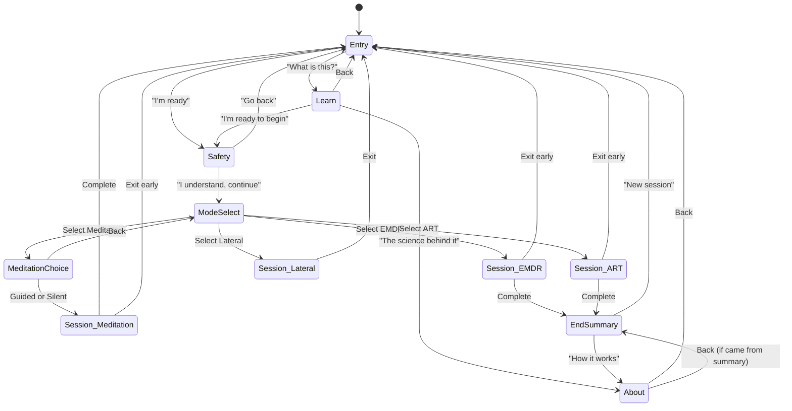
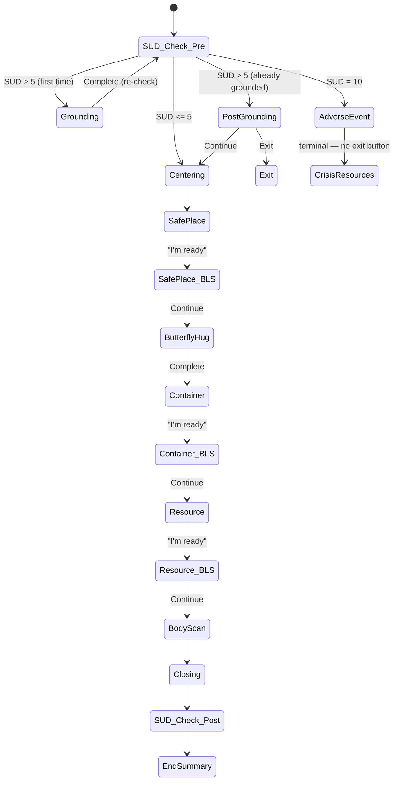
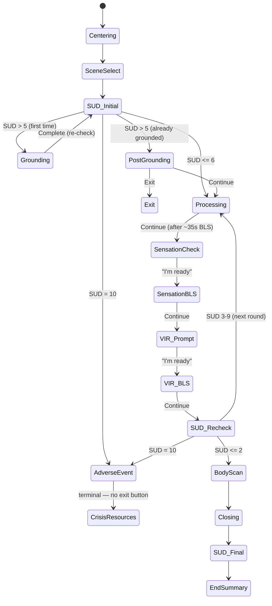
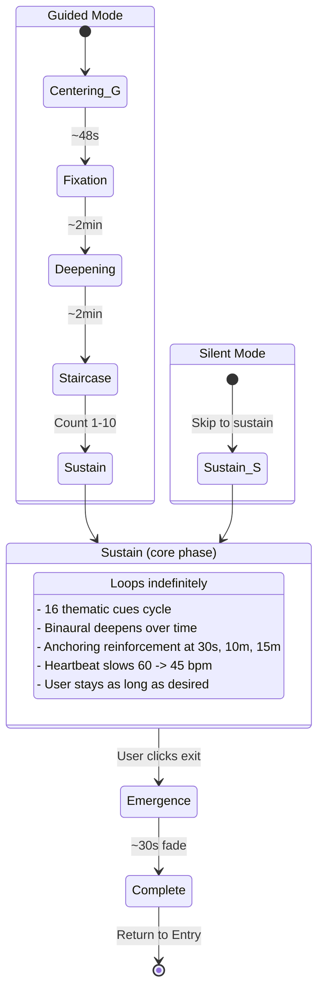
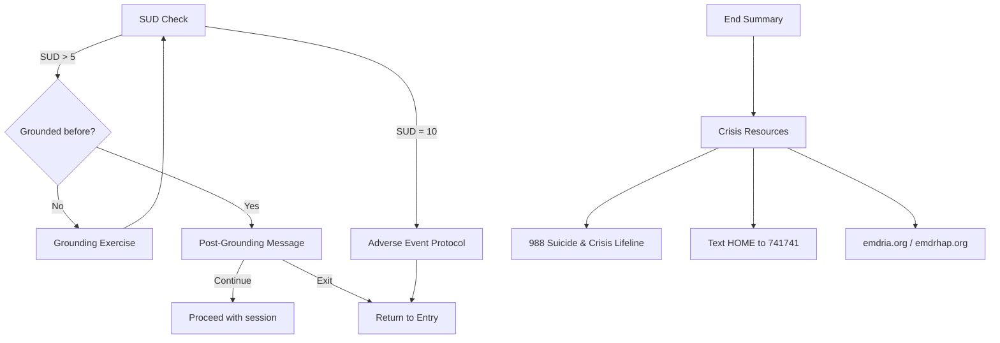

# User Experience Flow

## High-Level State Diagram



---

## Screen-by-Screen Breakdown

### 1. Entry

```
+--------------------------------------------------+
|                                                  |
|            . (slow-moving EMDR dot)              |
|                                                  |
|     EMDR / ART Self-Administered Experience      |
|                                                  |
|  Find a comfortable position. Put on headphones  |
|  for the full experience.                        |
|                                                  |
|       [ I'm ready ]   [ What is this? ]          |
|                  [ Full screen ]                  |
|                                                  |
|  This experience draws on select techniques...   |
|  emdria.org  |  emdrhap.org (pro bono)           |
+--------------------------------------------------+
```

**Appears with staggered timing:** text at 2s, buttons at 4s.

---

### 2. Learn (Educational Content)

Scrollable page covering: What is this? | What is EMDR? | What is ART? | Why do this? | How long? | Important note.

Buttons: **"I'm ready to begin"** | **"The science behind it"** (-> About page)

---

### 3. Safety Gate

```
+--------------------------------------------------+
|                                                  |
|              Before you begin                    |
|                                                  |
|  EMDR and ART are clinical therapies. This is    |
|  a simplified self-guided version.               |
|                                                  |
|  - Use in a safe, private setting                |
|  - You can exit anytime (top left)               |
|  - Strong emotions may come up (normal)          |
|                                                  |
|  Call or text 988 for 24/7 crisis support        |
|                                                  |
|         [ Go back ]  [ I understand ]            |
+--------------------------------------------------+
```

---

### 4. Mode Select

```
+--------------------------------------------------+
|                                                  |
|          Choose your experience                  |
|                                                  |
|  Binaural tones: [ON / off]                      |
|                                                  |
|  [ EMDR          - Build calm & resources      ] |
|  [ ART           - Rescript a stressful memory ] |
|  [ MEDITATION    - Deep hypnotic relaxation    ] |
|  [ LATERAL       - Customizable BLS tool       ] |
|                                                  |
|  > not sure? click to find out more              |
+--------------------------------------------------+
```

---

### 5. Meditation Choice (meditation only)

```
+--------------------------------------------------+
|                                                  |
|       Choose your meditation style               |
|                                                  |
|  [ GUIDED  - voice, breathing, countdown       ] |
|  [ SILENT  - visuals & binaural only           ] |
|                                                  |
|  Visual flickering: [on / OFF]                   |
|  Binaural tones always on. Headphones recommended|
|                                                  |
|  < Back                                          |
+--------------------------------------------------+
```

---

## Session Flows

### EMDR Session



**Exercises completed:** Safe Place, Butterfly Hug, Container, Resource Installation, Body Scan

**Duration:** ~10-15 minutes

---

### ART Session



**Key feature:** Processing loop repeats until distress drops to 2 or below.

**Duration:** ~10-20 minutes (varies by rounds needed)

---

### Meditation Session



**Duration:** User-controlled, up to 2 hours. Guided adds ~7 min of induction before sustain.

---

### Lateral Session (Open-ended Tool)

```
+--------------------------------------------------+
| <- exit                        show/hide controls|
|                                                  |
|                                                  |
|             .  <---- moving dot ---->  .         |
|                                                  |
|                                                  |
|                                                  |
|                                                  |
|  +--------------------------------------------+  |
|  | Dot Speed     [=====|===========]          |  |
|  | Binaural Hz   [==|=====================]   |  |
|  | Binaural Vol  [===============|=========]  |  |
|  | Ping Sound    [===|====================]   |  |
|  | Pink Noise    [|========================]  |  |
|  +--------------------------------------------+  |
|                   3:42                           |
+--------------------------------------------------+
```

**No fixed duration.** User exits when ready. No end summary.

---

## End Summary (EMDR & ART only)

```
+--------------------------------------------------+
|                                                  |
|         {Mode} Session Complete                  |
|         Here's a summary of your session         |
|         April 8, 2026                            |
|                                                  |
|         Before:  7/10                            |
|         After:   3/10  (4 points improvement)    |
|                                                  |
|  Exercises / Rounds completed: ...               |
|                                                  |
|  [Educational text about the mode]               |
|  [Validation message]                            |
|                                                  |
|  Recent sessions:                                |
|  - EMDR  7 -> 3  Apr 8                          |
|  - ART   8 -> 2  Apr 7                          |
|  [Clear session history]                         |
|                                                  |
|  Crisis resources: 988 | Text HOME to 741741    |
|  emdria.org | emdrhap.org                        |
|                                                  |
|       [ New session ]   [ How it works ]         |
+--------------------------------------------------+
```

---

## Safety & Crisis Paths



---

## Audio System Across Modes

| Component | Meditation | EMDR | ART | Lateral |
|-----------|-----------|------|-----|---------|
| Binaural tones | Always on, deepens over time | Optional (toggle) | Optional (toggle) | User-controlled |
| Pink noise | Yes (depth-scaled) | Light background | Light background | User-controlled |
| Ping sounds | No | Bilateral taps | Bilateral taps | User-controlled |
| Heartbeat | Yes (slows over session) | No | No | No |
| Isochronic pulse | Yes | No | No | No |
| 2nd binaural layer | Yes | No | No | No |
| Voice narration | Guided only | Yes | Yes | No |
| Breath cues | Yes (guided) | No | No | No |

---

## Navigation Summary

| From | To | Trigger |
|------|----|---------|
| Entry | Learn | "What is this?" |
| Entry | Safety | "I'm ready" |
| Learn | Entry | Back |
| Learn | Safety | "I'm ready to begin" |
| Learn | About | "The science behind it" |
| Safety | Entry | "Go back" |
| Safety | Mode Select | "I understand, continue" |
| Mode Select | Session | Select EMDR / ART / Lateral |
| Mode Select | Meditation Choice | Select Meditation |
| Meditation Choice | Session | Guided / Silent |
| Meditation Choice | Mode Select | Back |
| Any Session | Entry | Exit button (top-left) |
| EMDR / ART Session | End Summary | Session complete |
| Meditation Session | Entry | Session complete |
| End Summary | Entry | "New session" |
| End Summary | About | "How it works" |
| About | Entry or End Summary | Back (smart routing) |
